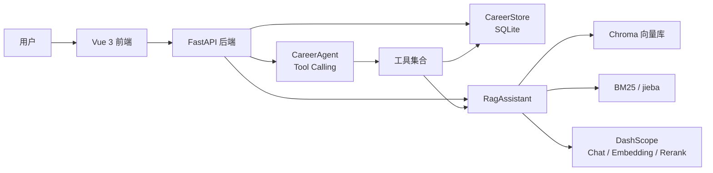
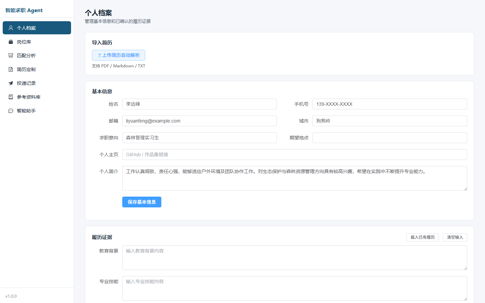
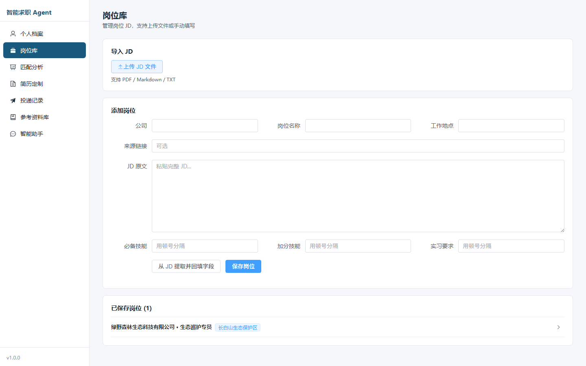
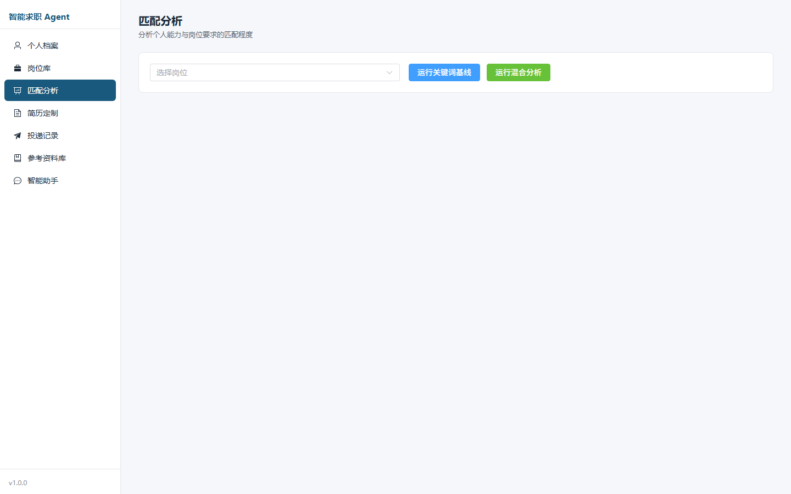
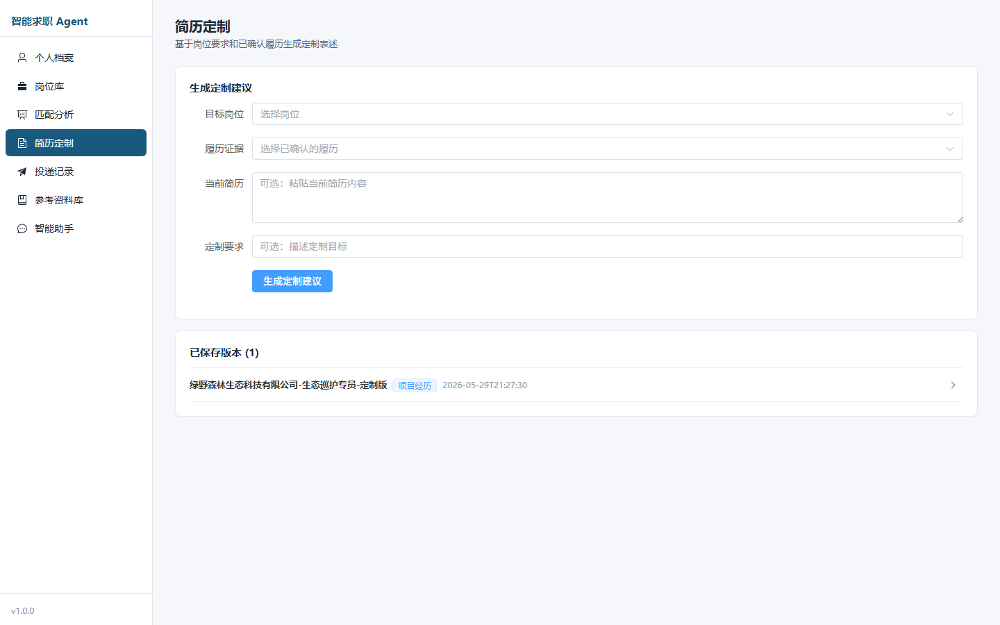
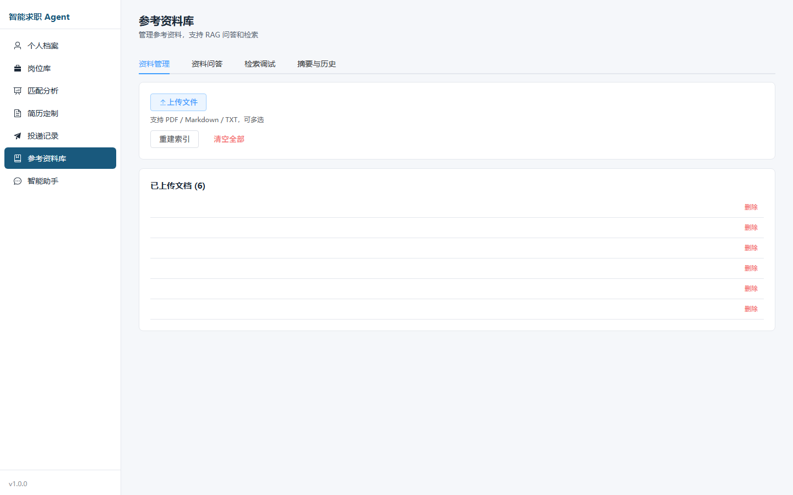
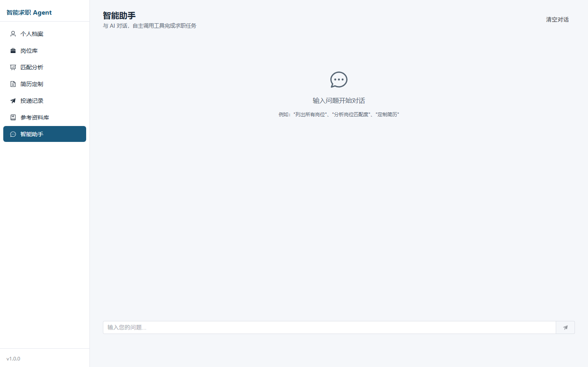
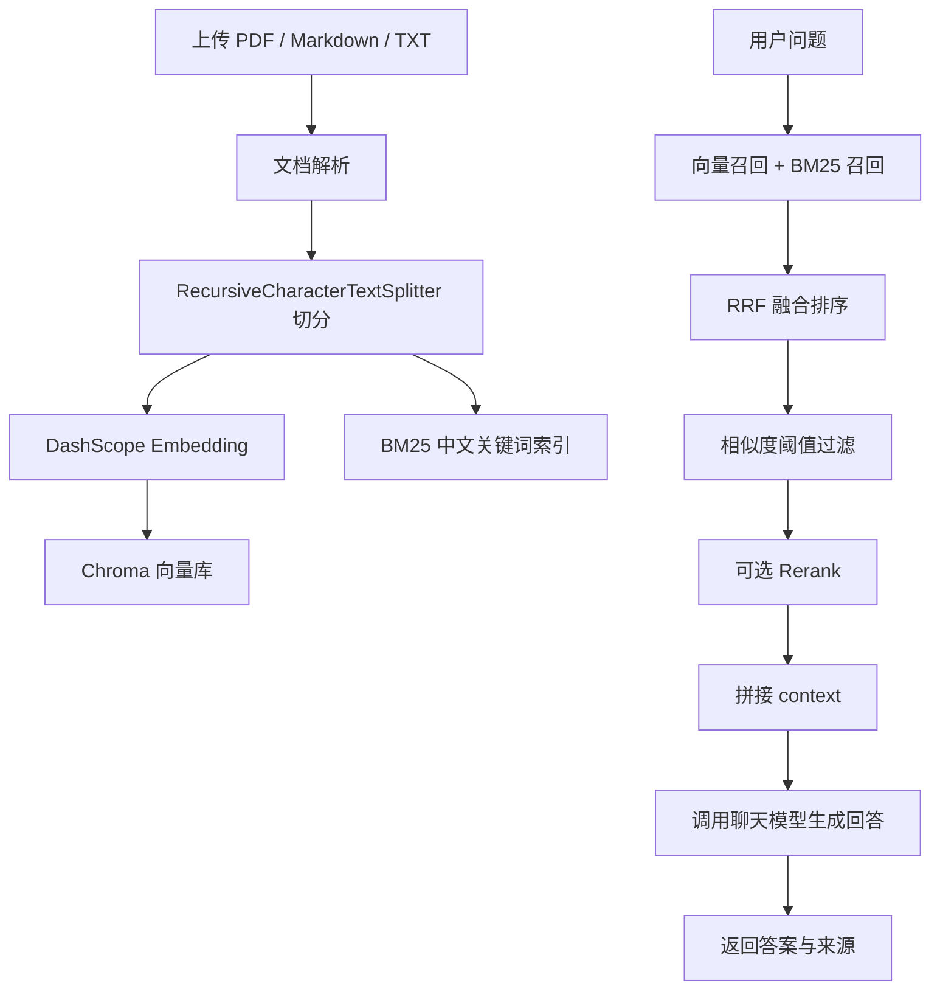

# Career RAG Agent

基于 **Vue 3 + FastAPI + RAG + Tool Calling** 的智能选岗及简历定制系统。项目围绕真实求职流程构建：维护个人履历证据，管理岗位 JD，分析岗位匹配度，生成定制简历表述，记录投递进度，并通过参考资料库提供 RAG 问答与检索调试能力。

## 项目亮点

- **前后端分离**：Vue 3 + TypeScript + Element Plus 构建工具型工作台，FastAPI 提供 REST API。
- **RAG 资料库**：支持 PDF / Markdown / TXT 上传，文档切分后写入 Chroma，并通过来源片段支撑回答。
- **混合检索**：向量检索结合 BM25 中文关键词检索，使用 RRF 融合排序，并支持相似度阈值与 rerank。
- **Tool Calling Agent**：智能助手可自主调用岗位、履历、匹配分析、简历定制、资料库问答等工具。
- **简历定制闭环**：基于已确认履历证据和目标岗位生成定制表述，支持保存版本并导出 Word / PDF。
- **工程化存储**：业务数据使用 SQLite，RAG 向量数据使用 Chroma，保留 JSON 迁移脚本。
- **可测试**：覆盖 RAG、DashScope Embedding、岗位解析、履历证据、Agent 工具调用等核心逻辑。

## 技术栈

| 层级 | 技术 |
|---|---|
| 前端 | Vue 3、TypeScript、Vite、Element Plus、Pinia、Vue Router、Axios、marked |
| 后端 | FastAPI、Pydantic、Uvicorn |
| Agent | LangChain Tool Calling、ReAct 多步工具调用 |
| LLM | DashScope OpenAI 兼容接口，默认 `qwen3.6-plus` |
| Embedding | DashScope `tongyi-embedding-vision-flash-2026-03-06` |
| 检索 | Chroma、BM25、jieba、RRF、DashScope Rerank |
| 存储 | SQLite、JSON 迁移兼容 |
| 导出 | python-docx、reportlab |
| 测试 | unittest、mock |

## 系统架构



## 功能模块

### 个人档案

- 维护姓名、电话、邮箱、城市、求职意向、个人简介等基础信息。
- 维护教育背景、专业技能、项目经历、奖项成果、求职意向等履历证据。
- 支持上传简历文件并自动解析回填，用户确认后再进入匹配和定制流程。

### 岗位库

- 支持手动录入 JD 或上传 PDF / Markdown / TXT 岗位文件。
- 自动提取公司、岗位、地点、必备技能、加分技能、实习要求。
- 保留原始 JD，便于后续复核和重新分析。

### 匹配分析

- 关键词基线分析：必备技能与加分技能分开计算。
- 语义增强分析：结合已确认履历证据，生成语义匹配分数和解释。
- 履历变化后保留旧分析作为历史，并标记需要重新计算。

### 简历定制

- 基于目标岗位和选中的履历证据生成定制表述。
- 输出适配判断、证据依据、缺口提示和推荐表述。
- 支持保存定制版本，并导出 Word / PDF。

### 投递记录

- 管理岗位投递状态、使用的简历版本、投递时间和备注。
- 将岗位、匹配分析、简历版本、投递状态串成完整求职流程。

### 参考资料库

- 支持资料上传、删除、重建索引。
- 支持资料问答、检索调试、摘要生成和历史记录管理。
- 回答必须基于检索片段，资料中没有的信息会明确提示未找到。

### 智能助手

- 通过自然语言调用工具完成求职任务。
- 支持查询个人档案、列出岗位、分析匹配度、检索资料库、定制简历。
- 支持多步工具调用，并在前端展示工具执行过程。

## 效果截图

| 页面 | 截图 |
|---|---|
| 个人档案 |  |
| 岗位库 |  |
| 匹配分析 |  |
| 简历定制 |  |
| 参考资料库 |  |
| 智能助手 |  |

## 快速开始

### 1. 后端环境

```powershell
conda activate Agent
pip install -r requirements.txt
```

复制 `.env.example` 为 `.env`，配置 DashScope：

```env
DASHSCOPE_API_KEY=your_dashscope_api_key_here
DASHSCOPE_BASE_URL=https://dashscope.aliyuncs.com/compatible-mode/v1
OPENAI_MODEL=qwen3.6-plus
OPENAI_EMBEDDING_MODEL=tongyi-embedding-vision-flash-2026-03-06
```

启动 FastAPI：

```powershell
cd E:\Agent应用开发
python -m uvicorn api.main:app --reload --port 8000
```

API 文档：

```text
http://127.0.0.1:8000/docs
```

### 2. 前端环境

```powershell
cd E:\Agent应用开发\frontend
npm install
npm run dev
```

前端页面：

```text
http://127.0.0.1:5173/
```

如果 `npm` 找不到，请确认 Node.js 已加入 PATH。本项目本地使用的 Node.js 位置为：

```text
D:\DevTools\nodejs
```

## 使用流程

推荐按照下面顺序体验：

```text
个人档案 -> 岗位库 -> 匹配分析 -> 简历定制 -> 投递记录
                     |
                     v
                  参考资料库
                     |
                     v
                  智能助手
```

1. 在个人档案中录入或导入履历，并确认履历证据。
2. 在岗位库中录入或导入目标岗位 JD。
3. 在匹配分析中查看能力覆盖、缺口和优化建议。
4. 在简历定制中选择岗位和证据，生成定制表述并保存版本。
5. 在投递记录中记录投递状态和使用的简历版本。
6. 在参考资料库中上传简历规范、面试资料、公司资料等，用 RAG 问答辅助求职。
7. 在智能助手中用自然语言串联多个工具。

## RAG 流程



## Tool Calling 工具

智能助手目前封装了 8 个工具：

| 工具 | 作用 |
|---|---|
| `search_knowledge` | 检索参考资料库片段 |
| `ask_knowledge` | 基于参考资料库回答问题 |
| `list_jobs` | 列出岗位 |
| `get_job` | 查看岗位详情 |
| `analyze_match` | 运行岗位匹配分析 |
| `list_evidence` | 查看履历证据 |
| `tailor_resume` | 生成简历定制建议 |
| `get_profile` | 查看个人档案 |

## 数据存储

```text
data/career.db       SQLite 业务数据
data/chroma/         Chroma 向量库
data/bm25/           BM25 索引
data/uploads/        参考资料上传文件
data/resume_uploads/ 简历上传文件
data/job_uploads/    岗位上传文件
data/history.jsonl   RAG 问答历史
```

如果已有 JSON 数据，可以运行：

```powershell
python migrate_json_to_sqlite.py
```

## 测试

```powershell
python -m unittest discover -s tests -v
python -m compileall app.py rag_agent.py career_store.py agent.py tools.py api_client.py db.py bm25_index.py resume_export.py api
```

当前测试覆盖：

- DashScope Embedding 响应解析
- 文档上传、删除、历史记录管理
- 检索阈值和 `score=None` 兜底
- 岗位 JD 与简历解析
- 匹配分析和简历定制
- Tool Calling Agent 的对象式/字典式 tool call 兼容
- CareerStore 的履历、岗位、分析、投递、版本管理

## 简历写法示例

项目名：**基于 RAG 与 Tool Calling 的智能选岗及简历定制 Agent**

项目描述：

> 设计并实现一个前后端分离的智能求职系统，支持个人履历管理、岗位 JD 解析、岗位匹配分析、简历定制生成、投递记录管理和参考资料库 RAG 问答。系统前端采用 Vue3 + TypeScript + Element Plus，后端采用 FastAPI + SQLite，RAG 部分使用 DashScope Embedding、Chroma、BM25、RRF 和 Rerank，Agent 部分基于 LangChain Tool Calling 封装岗位查询、履历证据、匹配分析、简历定制和资料库问答等工具。

项目成果：

- 构建从“个人档案 -> 岗位库 -> 匹配分析 -> 简历定制 -> 投递记录”的完整求职工作流。
- 实现向量检索 + BM25 的混合召回，并通过 RRF 融合排序、阈值过滤和 rerank 提升检索质量。
- 封装 8 个求职工具供 Agent 自主调用，支持多步工具执行和前端过程展示。
- 支持简历定制版本保存与 Word / PDF 导出，降低针对不同岗位修改简历的重复成本。

## 注意事项

- `.env`、`data/`、`output/`、`tmp/`、`frontend/node_modules/`、`frontend/dist/` 不应提交到 Git。
- 聊天模型和嵌入模型不要混用：聊天模型负责理解和生成，嵌入模型负责向量化。
- AI 生成的简历建议必须基于用户确认过的履历证据，不应凭空补经历。
